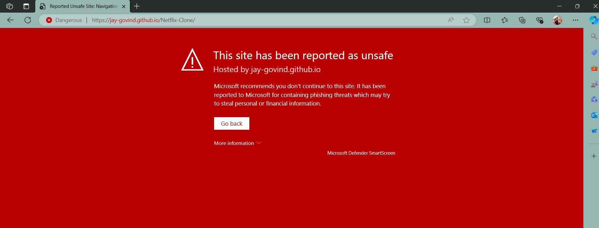

# Netflix UI CLONE

> [!CAUTION]
> ## Potential Browser Warning!
> Please note that when visiting the deployed version of this project on GitHub Pages, some browsers might display a warning message about the site being unsafe or dangerous. This could be due to various reasons such as mixed content issues or historical flags from Google's Safe Browsing services.
>
> ## How to solve the problem
> 
> <li>Go to Google search console.</li>
> <li> In the upper left corner add your project according to the url of your site.</li>
> <li> At this stage you can choose several ways to confirm that you are the administrator of the site you wrote, one of them and the easiest in my opinion, is to plant a line of code in the header of the html .
> <li> After that he will wait a little and confirm that it does exist on this site and you can continue in Google Search Console.</li>
> <li> Go to the 'Overview' tag where you will see a red message that your site has been blocked due to suspected copying.</li>
> <li> Go to the comment and select the option to send an email to Google and request the removal of the block and explain in the email that you are doing this for educational purposes and not stealing copyrights.</li>
> 

<br>

## Clone the repo in your PC 🧑‍💻
> Run the below command in your terminal 
```
git clone https://github.com/Jay-Govind/Netflix-Clone.git
```
<br>

> [👉 Click Me To Check Output](https://jay-govind.github.io/Netflix-Clone)

<br>

### Description
> <ul>
  <li>Programmed a responsive clone of Netflix's home page using HTML and CSS.</li>
  <li>Ensured compatibility across various devices, including desktop and mobile phones.</li>
  <li>Developed at an intermediate level, showcasing proficiency in front-end web development techniques.</li>
  </ul>

<br>

## 📸 ScreenShots
||
|-------------------------------|
|| 
||

## ⚖️ License 
> License - [Click Me](https://github.com/Jay-Govind/Netflix-Clone/blob/c8c9ba3f5329a818260bba6d6fd200d260e104fe/LICENSE)
